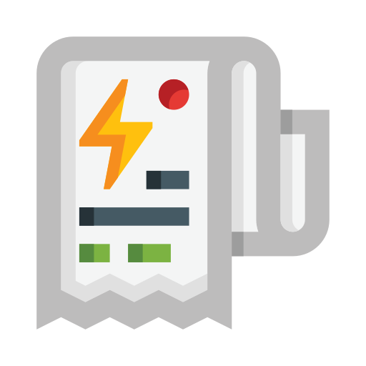
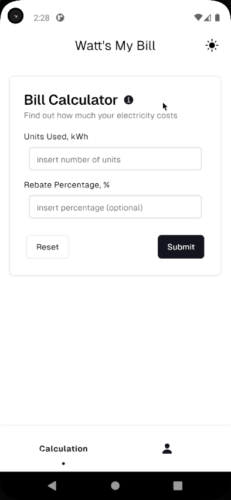

<a name="readme-top"></a>

<!-- PROJECT LOGO -->
<br />
<div align="center">
  <a href="https://github.com/Kyziq/watts-my-bill-calculator">
    
  </a>

<h3 align="center">Watt's My Bill</h3>

  <p align="center">
    A simple Flutter app to calculate your electricity bill based on TNB's domestic tariff rates.
    <br />
    <br />
    <a href="https://github.com/Kyziq/watts-my-bill-calculator/issues">Report Bug</a>
    ·
    <a href="https://github.com/Kyziq/watts-my-bill-calculator/issues">Request Feature</a>
  </p>
</div>

<!-- DEMO GIF -->
<div align="center">
  
</div>

<!-- TABLE OF CONTENTS -->
<details>
  <summary>Table of Contents</summary>
  <ol>
    <li>
      <a href="#about-the-project">About The Project</a>
      <ul>
        <li><a href="#features">Features</a></li>
        <li><a href="#built-with">Built With</a></li>
      </ul>
    </li>
    <li>
      <a href="#getting-started">Getting Started</a>
      <ul>
        <li><a href="#prerequisites">Prerequisites</a></li>
        <li><a href="#installation">Installation</a></li>
      </ul>
    </li>
    <li><a href="#usage">Usage</a></li>
    <li><a href="#usage">Contributing</a></li>
    <li><a href="#license">License</a></li>
  </ol>
</details>

## About The Project

**Watt's My Bill** is a Flutter mobile application developed as part of a Mobile Technology Assignment. It aims to help users easily estimate their electricity bills based on their consumption and the current tariff rates provided by Tenaga Nasional Berhad (TNB), Malaysia's primary electricity utility company.

### Features

- **Calculate electricity bill:** Enter your electricity consumption in kilowatt-hours (kWh) and any applicable rebate percentage.
- **View TNB tariff rates:** Access detailed information about TNB's domestic tariff rates (as of May 2024) to understand how your bill is calculated.
- **Customizable:** Adjust the app's appearance with different themes.
- **Error handling:** Provides clear error messages for invalid inputs.

### Built With

[![Flutter][Flutter]][Flutter-url]

<p align="right">(<a href="#readme-top">back to top</a>)</p>

<!-- GETTING STARTED -->

## Getting Started

To run this app on your local machine, follow these steps:

### Prerequisites

- **Flutter SDK:** Make sure you have the Flutter SDK installed. You can download it from the official Flutter website: [https://flutter.dev/](https://flutter.dev/)

### Installation

1. **Clone the repo:**

   ```sh
   git clone https://github.com/Kyziq/watts-my-bill-calculator

   ```

2. **Install dependencies:**

   ```sh
   flutter pub get

   ```

3. **Run the code:**
   ```sh
   flutter run
   ```

<p align="right">(<a href="#readme-top">back to top</a>)</p>

<!-- USAGE EXAMPLES -->

## Usage

Estimate your electricity bill with ease:

1. **Enter Units:** Input the total electricity units consumed (in kWh).
2. **Optional Rebate:** If you have a rebate, enter the percentage in the "Rebate Percentage" field. Leave it blank if you don't have a rebate.
3. **Calculate Bill:** Click the "Submit" button to get your estimated bill.
4. **View Tariff Rates (Optional):** For a detailed breakdown of TNB's tariff rates (as of May 2024), click the info (🛈) button.

<p align="right">(<a href="#readme-top">back to top</a>)</p>

<!-- CONTRIBUTING -->

## Contributing

Contributions are what make the open source community such an amazing place to learn, inspire, and create. Any contributions you make are **greatly appreciated**.

If you have a suggestion that would make this better, please fork the repo and create a pull request. You can also simply open an issue with the tag "enhancement".
Don't forget to give the project a star! Thanks again!

1. Fork the Project
2. Create your Feature Branch (`git checkout -b feature/AmazingFeature`)
3. Commit your Changes (`git commit -m 'Add some AmazingFeature'`)
4. Push to the Branch (`git push origin feature/AmazingFeature`)
5. Open a Pull Request

<p align="right">(<a href="#readme-top">back to top</a>)</p>

<!-- LICENSE -->

## License

Distributed under the MIT License. See `LICENSE` for more information.

<p align="right">(<a href="#readme-top">back to top</a>)</p>

<!-- MARKDOWN LINKS & IMAGES -->
<!-- https://www.markdownguide.org/basic-syntax/#reference-style-links -->

[product-screenshot]: images/screenshot.png
[Flutter]: https://img.shields.io/badge/Flutter-%2302569B.svg?style=for-the-badge&logo=Flutter&logoColor=white
[Flutter-url]: https://flutter.dev/
